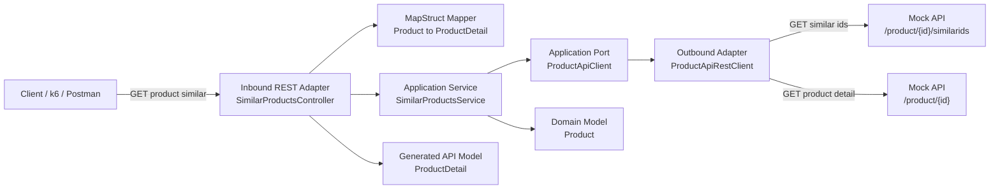

# Similar Products API

## Overview

This Spring Boot application implements the public endpoint:

- `GET /product/{productId}/similar`

The endpoint returns similar product details while preserving the similarity order from downstream IDs.

Runtime endpoints:

- Application: `http://localhost:5000`
- Provided mocks: `http://localhost:3001`

## Contract-first approach

- Public API contract source: `similarProducts.yaml`.
- OpenAPI Generator is used to generate the public API interface.
- The REST controller implements the generated interface to keep implementation and contract aligned.
- The downstream client (`existingApis.yaml`) is intentionally not generated, so timeout behavior, error mapping, and similar ID normalization remain explicitly controlled in code.

## Architecture

The solution follows a lightweight hexagonal architecture:

- Domain model: internal `Product`.
- Application service: use-case orchestration in `SimilarProductsService`.
- Application port: `ProductApiClient`.
- Inbound REST adapter: `SimilarProductsController`.
- Outbound Product API adapter: `ProductApiRestClient`.
- Infrastructure configuration: typed properties and bean configuration for client and executor.
- Shared error handling: global HTTP error mapping via `@RestControllerAdvice`.



## Functional behavior

- `/product/{productId}/similarids` is mandatory.
- Failures in mandatory similar IDs retrieval are propagated.
- Individual `/product/{similarId}` calls are best-effort.
- Individual detail failures are omitted from the final response.
- Output preserves original similarity order for successful products.
- Timeouts are configured to avoid long blocking downstream waits.
- A dedicated executor is used for controlled concurrency.

## Resilience and reactive programming trade-offs

This implementation intentionally prioritizes clarity, determinism, and scope-fit for the current technical test.

Current baseline implemented in code:

- HTTP timeouts in the downstream client.
- Controlled concurrency with a dedicated executor.
- Partial response behavior for individual product detail failures.
- Global error handling.
- Explicit separation between mandatory similar IDs retrieval and best-effort product detail enrichment.

Scope decisions for this implementation:

- No Circuit Breaker in initial scope.
  - For this project size, explicit timeout plus error mapping provides predictable behavior.
  - In production, Circuit Breaker around ProductApiClient would be a strong candidate.
- No default Retry.
  - Retry in fan-out flows can amplify downstream pressure because each failed detail call may be multiplied.
  - Retry should be selective, only for transient errors, with backoff, jitter, and low retry limits.
  - Retry should not be applied to 404 responses.
- No WebFlux/WebClient for this implementation.
  - Reactive non-blocking I/O is a valid alternative.
  - For this test, Spring MVC plus RestClient plus CompletableFuture plus a dedicated executor was chosen for readability and delivery scope.

Production-grade improvements (next step candidates):

- Resilience4j CircuitBreaker.
- Bulkhead.
- TimeLimiter.
- Selective Retry with backoff and jitter.
- Additional application metrics.
- Optional WebClient/WebFlux migration if end-to-end non-blocking processing is required.

## Runbook

### 1) Start provided mocks and observability stack

From repository root:

```bash
docker-compose up -d simulado influxdb grafana
```

### 2) Start application

From `yourApp`:

```bash
mvn spring-boot:run
```

### 3) Run Java tests

From `yourApp`:

```bash
mvn test
```

### 4) Manual smoke checks

```bash
curl http://localhost:3001/product/1/similarids
curl http://localhost:5000/product/1/similar
curl http://localhost:5000/product/2/similar
curl http://localhost:5000/product/3/similar
curl http://localhost:5000/product/4/similar
curl http://localhost:5000/product/5/similar
```

Expected behavior with initial `read-timeout=1500ms`:

- Product 1: products 2, 3, 4.
- Product 2: typically products 3 and 100 (1000 may be omitted by timeout).
- Product 3: typically product 100 (1000 and 10000 may be omitted by timeout).
- Product 4: products 1 and 2, omitting product 5 (404).
- Product 5: products 1 and 2, omitting product 6 (500).

## Postman manual verification

- Import collection from: `yourApp/postman/similar-products.postman_collection.json`.
- Before running it:
  - Start mocks with `docker-compose up -d simulado influxdb grafana`.
  - Start app with `mvn spring-boot:run` from `yourApp`.

The collection validates:

- Normal scenario.
- Partial response under slow/timeout behavior.
- Partial response when an individual product returns 404.
- Partial response when an individual product returns 500.
- Order preservation for successful products.

## k6 performance test

Run from repository root:

```bash
docker-compose run --rm k6 run scripts/test.js
```

Dashboard:

- `http://localhost:3000/d/Le2Ku9NMk/k6-performance-test`

k6 scenarios:

- normal: `/product/1/similar`
- notFound: `/product/4/similar`
- error: `/product/5/similar`
- slow: `/product/2/similar`
- verySlow: `/product/3/similar`

Each scenario runs with 200 VUs.

Observed behavior from recent runs:

- All scenarios complete.
- Responses are predominantly 200.
- Slow and verySlow phases increase latency due to mock delays.
- Timeout and partial response strategy prevents waiting for extreme downstream delays.
- Occasional 502 responses may appear in `error` scenario under load in some runs; this is documented as an operational observation for possible future tuning.

## Proposed CI (not implemented yet)

Current status:

- A backend CI workflow is not implemented yet in this repository.

Recommended minimal CI scope:

- Trigger on pull requests and pushes to main.
- Use Java 21.
- Cache Maven dependencies.
- Run backend verification with:

```bash
mvn -f yourApp/pom.xml -B test
```

Out of scope for now (to avoid overengineering):

- Automatic deployment.
- Heavy quality gates beyond build and tests.
- Full performance gating in CI.

## Proposed traceability and observability improvements (not implemented yet)

Current status:

- k6 metrics can be visualized in Grafana through the provided stack.
- Application-level request traceability is limited to current logs.

Recommended next steps:

- Add request correlation ID in inbound requests and propagate it to downstream calls.
- Include correlation ID in structured logs for controller, service, and outbound adapter events.
- Add minimal application metrics (request count, error count, request duration by endpoint and status).
- Create a focused Grafana dashboard for API behavior (`2xx`, `4xx`, `5xx`, latency percentiles, timeout-related errors).

Benefits:

- Faster root-cause analysis when intermittent `502` appears under load.
- Better visibility of partial-response behavior in slow and verySlow scenarios.
- Clearer evidence during technical review and future tuning.
